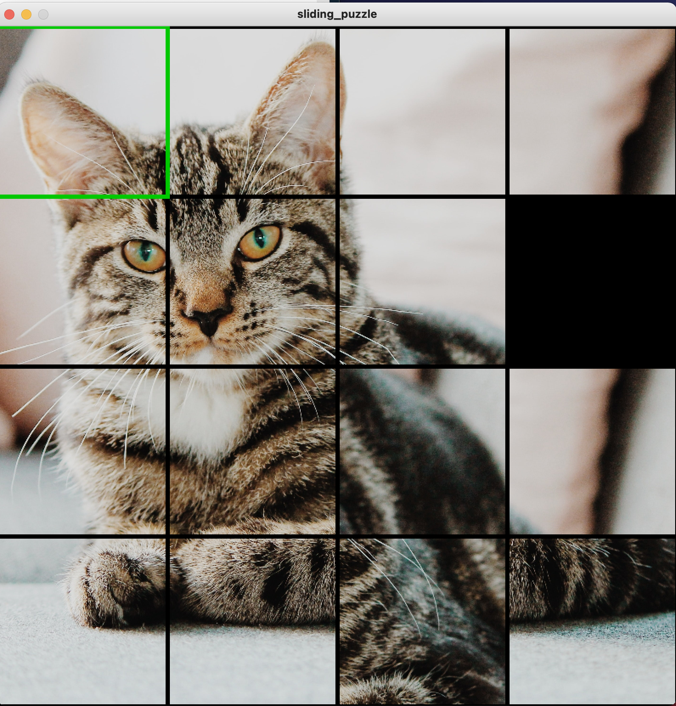
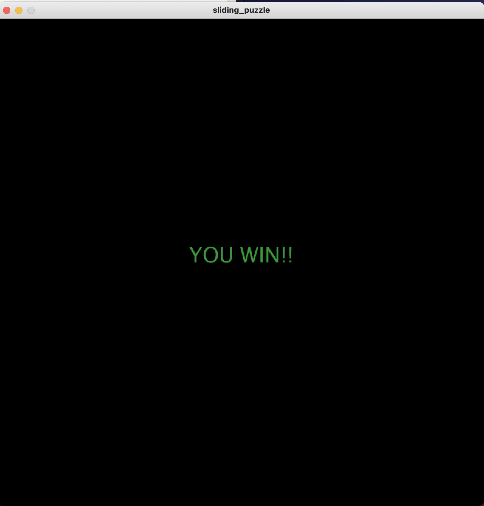

# SLIDING PUZZLE GAME

## Game Play and Workings
The game is a sliding puzzle where the difficulty determined by the number of times shuffled. After the user wins, the user can simply click to restart the game. The main classes were the Tile class and the Puzzle class which controlled the tiles and entire game respectively. The Tile class was used to create new tile objects and the puzzle class had all the logic of the game.

Since the tiles were number 0-15 depending on their row and column, I found that multiplying the row * NUM_ROWS + col gave the value from 0-15.
Also, the game has a lot of additional features that could be added such as random images and different difficulty levels.

