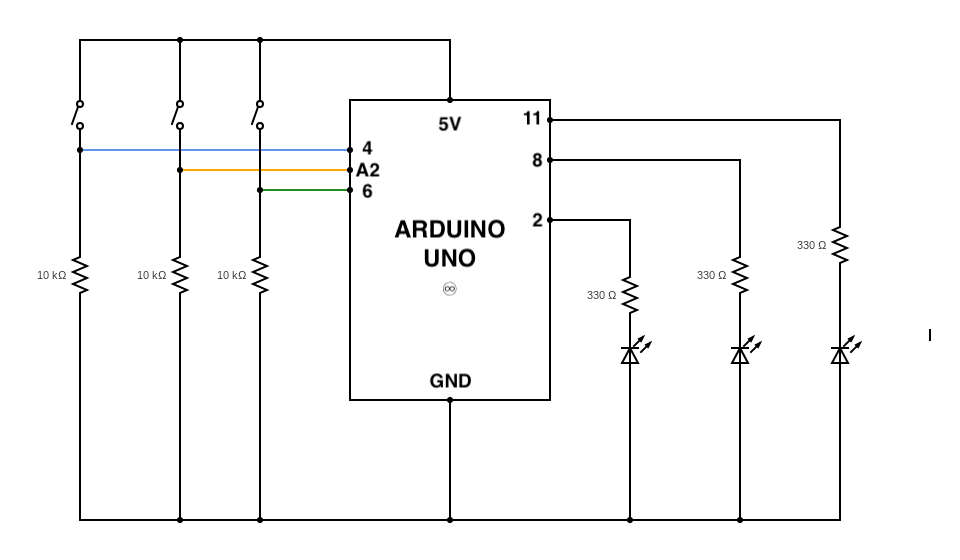

## SIMPLE ARDUINO LED PUZZLE

This is the schematic diagram of the arduino LED puzzle. 

## DEMO
<iframe width="1280" height="720" src="https://www.youtube.com/embed/eRya_7ppPos" title="YouTube video player" frameborder="0" allow="accelerometer; autoplay; clipboard-write; encrypted-media; gyroscope; picture-in-picture" allowfullscreen></iframe>

Pressing the buttons cause the LEDs to blink in a non sequential order

