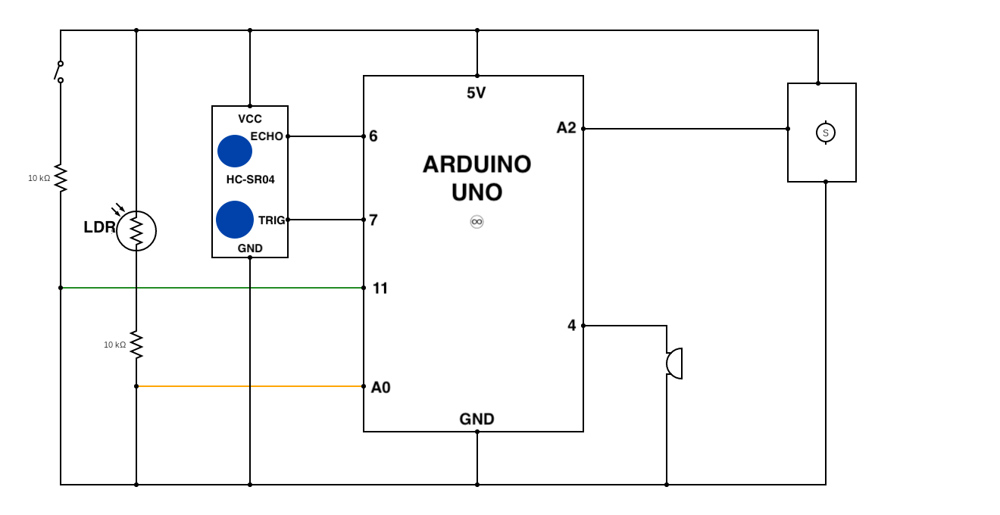
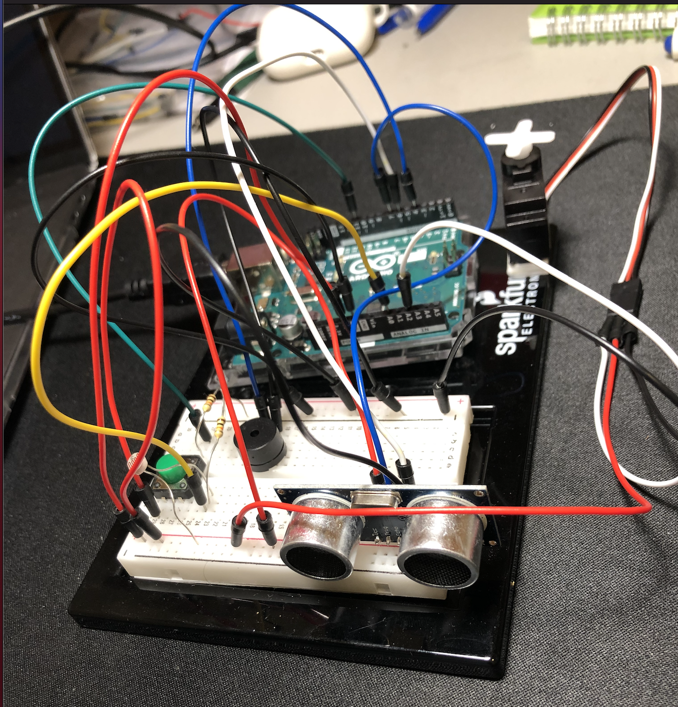

## ARDUINO MUSIC
This project uses a servo and a buzzer to create music. The servo moves repeatedly creating a beat pattern, which the user can then play different notes on the buzzer corresponding to the distance measured by the hc-sr04 sensor.

Here are the notes played: 
```
#include "pitches.h"

// notes to play, when the LDR is shaded or not
int lightNotes[] = {NOTE_A6, NOTE_B6, NOTE_C6, NOTE_D6, NOTE_E6, NOTE_F6, NOTE_C7, NOTE_D7,  NOTE_A7, NOTE_B7, NOTE_C7, NOTE_D7, NOTE_E7, NOTE_F7, NOTE_C8, NOTE_D8}; // 0-7 corresponds to a lower pitch, 8-16 corresponds to a higher pitch

int darkNotes[] = {NOTE_C4, NOTE_D4, NOTE_E4, NOTE_F4, NOTE_G4, NOTE_A4, NOTE_B4, NOTE_C5,   NOTE_C5, NOTE_D5, NOTE_E5, NOTE_F5, NOTE_G5, NOTE_A5, NOTE_B5, NOTE_C6}; // 0-7 corresponds to a lower pitch, 8-16 corresponds to a higher pitch

```

### Schematic



### Instructions
- Pressing the green button moves the pitches played higher, in both bright light and low light situations.
- When there is low light, lower pitches are played
- When there is bright light, higher pitches are played


### Image and Demo
[Here](https://youtu.be/CyU2ffk_EIU) is the video demo on youtube





### Challenges
My biggest challenge was figuring out how to use the distance measuring sensor since I had not used it before. My second biggest challenge was figuring out what instrument I was going to make.

