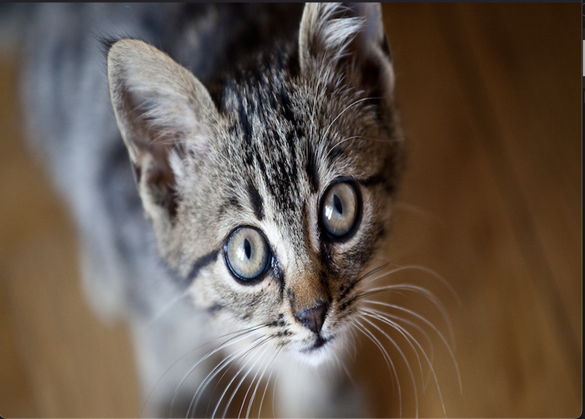
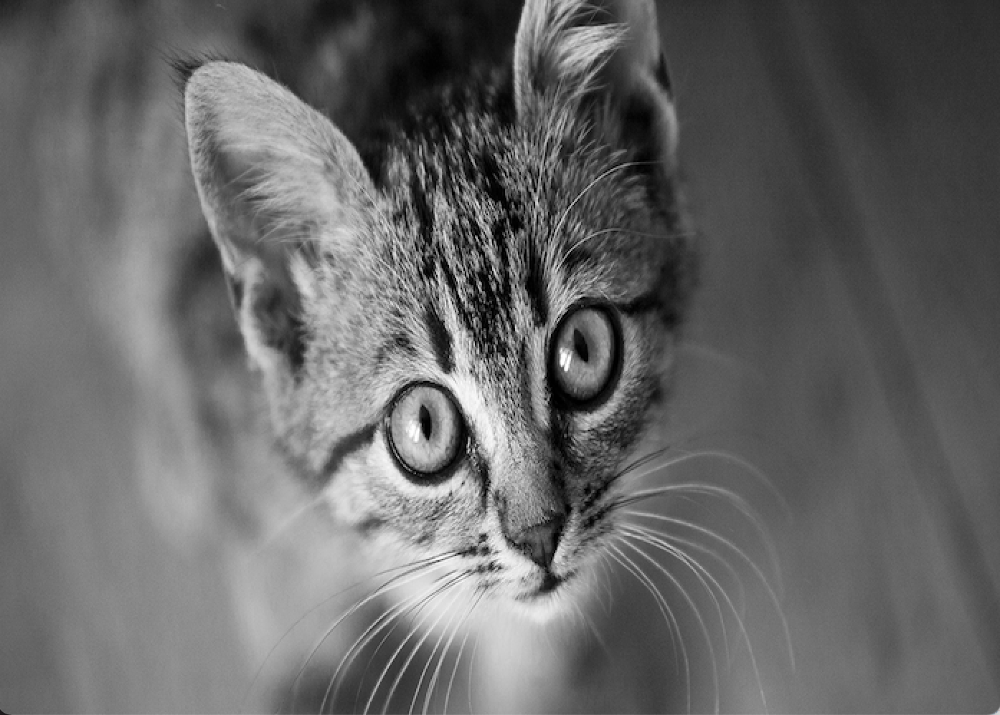
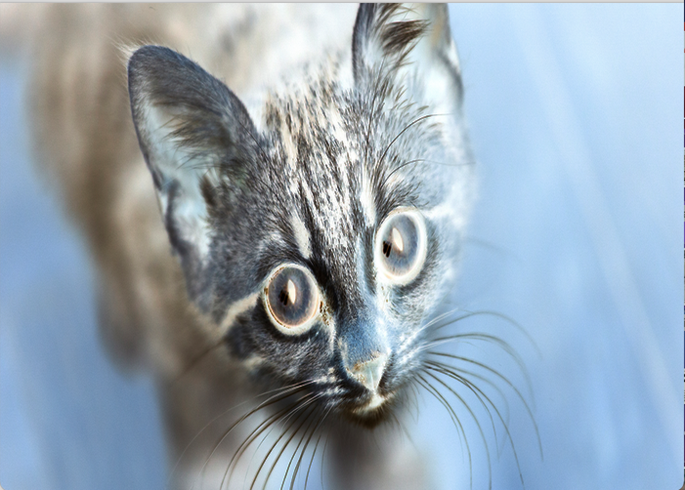

# Simple Inverted and Black-and-White filter

This is a simple filter to change images to inverted or black and white when the mouse is clicked. I want to advance this 
into an inverted and black and white video filter but video streaming on mac does not grant permission to processing.

