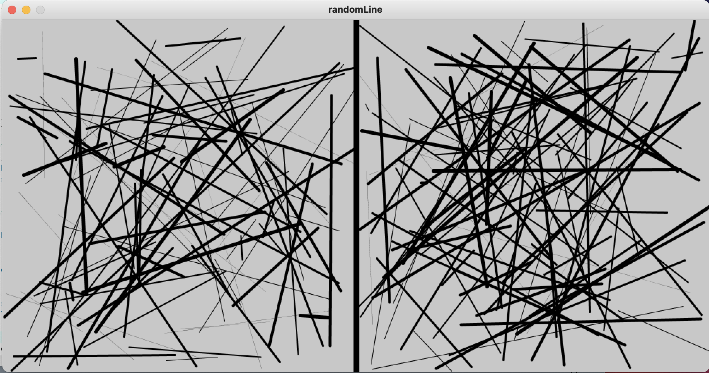
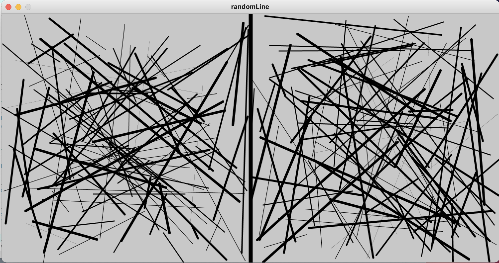

# Random Lines Visualizer 

This visualizer was inspired partly by computer art magazines and also by my desire to find out just how random the random() function is. 

## Below is interface of the program

