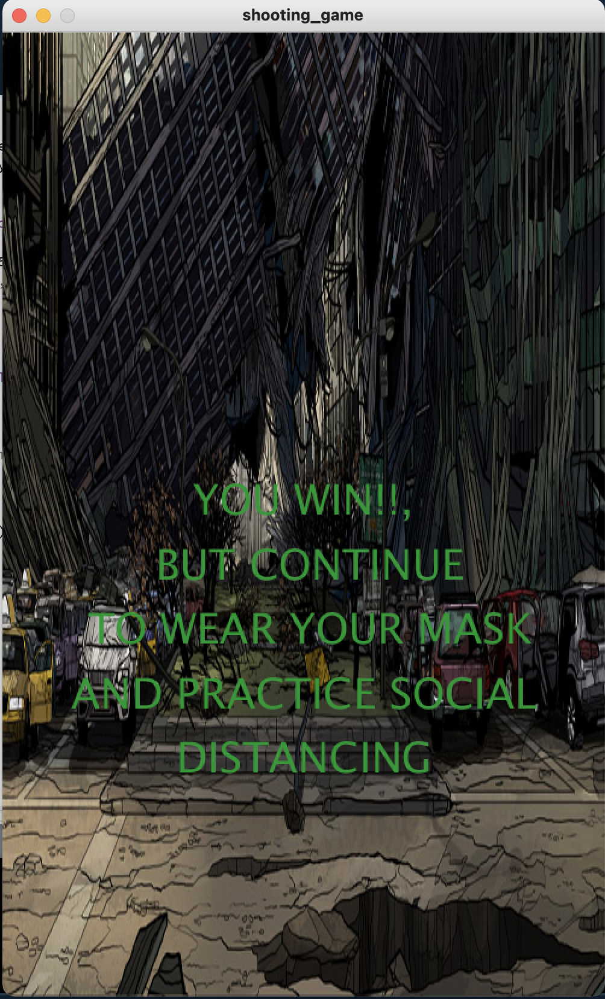

# COVID SHOOTING GAME




This game is a simple shooting game where the user shoots covid particles on the screen.  
The main moving pieces were the covid particles and the aiming scope which I defined using two classes for the covid sprites and the main game

To make the covid particles bounce between the sides of the screen, I found that making the speed the negetive of its previous value when it reached a wall was all it took to make the particles bounce between the screen. The code for that is given below: 

````
public void update() {
    if (row + 2*radius > width-50) { // changing the direction if the sprite touches the edge of the screen
      speed = -1 * speed; // making the negative of its previous value
    } else if (row - 2*radius < 50) {
      speed = -1 * speed; // negating the speed with its previous
    }
    row+=speed; // updating the row position
    }
````
