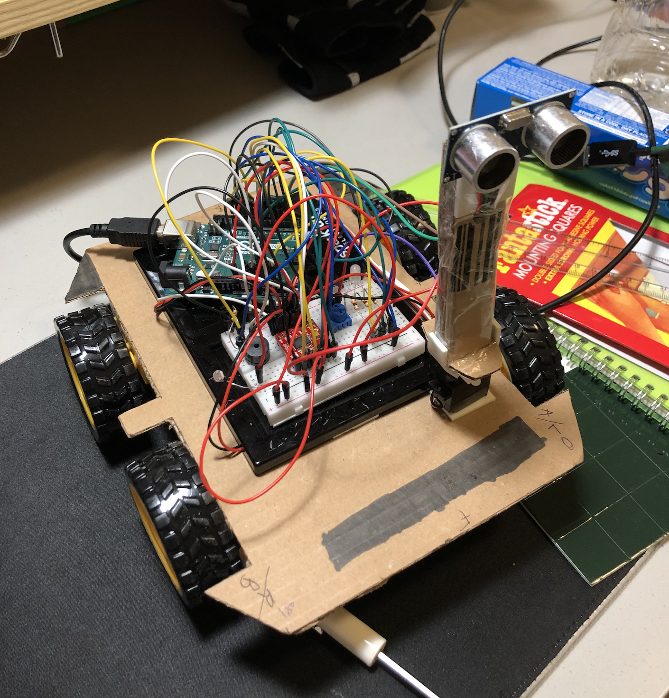

## Mars On Earth Rover
This project was inspired by the curiosity rover currently exploring the martian surface. This project interfaces both processing and arduino. The processing interface is used to control the rover and the arduino is the main hardware of the rover. The rover also has a self-driving mode where it avoids obstacles in its path.

### Design
The rover consist of a main chassis with four tires on which the circuit and arduino are mounted. The main components of the circuit are the motor driver, piezo buzzer, light dependent resistor, potentiometer, DC motors, servo, and a distance measuring sensor. 

