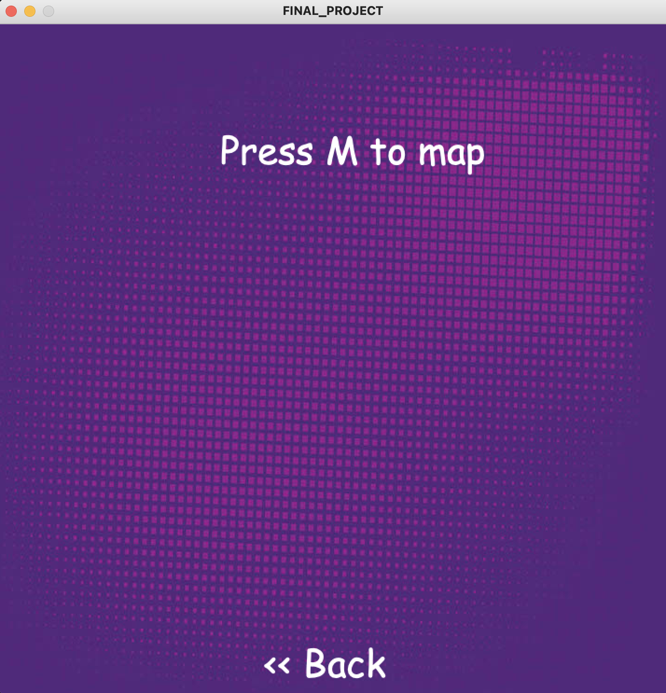

## Mars On Earth Rover
This project was inspired by the curiosity rover currently exploring the martian surface. This project interfaces both processing and arduino. The processing interface is used to control the rover and the arduino is the main hardware of the rover. The rover also has a self-driving mode where it avoids obstacles in its path.

### Design
The rover consist of a main chassis with four tires on which the circuit and arduino are mounted. The main components of the circuit are the motor driver, piezo buzzer, light dependent resistor, potentiometer, DC motors, servo, and a distance measuring sensor. 


### Processing Screens
Below are the screens of the project including the instructions screen, map screen and drive screens.




### Control
The rover has two main modes depending on the position of the potentiometer. When the potentiometer is less than 30% of the the way through, the rover would be in self-Driving mode where it avoids obstacles. Similarly, when the potentiometer is over 70% of the way, the rover would be in manual control mode where the user would have to control the rover with the arrow keys in processing. The rover also automatically lights up when it is in dark environments.

### Mapping
The rover also has the mode to map the surrounding when the user presses M in processing. I achieved this by sending the servo angle and the distance measured by the Distance Measuring Sensor (DMS) and then calculated the x and y coordinates of the points (code below). 
```
    // getting the x and y positions from the angle
    xPosition = abs(round(hypotenus * cos(angle)));
    yPosition = abs(round(hypotenus * sin(angle)));
    
    xPosition = round(map(xPosition, 0, 110, 0, width));
    yPosition = round(map(yPosition, 0, 110, 0, height));
    
```

### Schematic
The Schematic below shows all the components I used to construct the circuit.            


### Video Gallery
Here are links to videos of the different stages and modes of the rover. 

[Here is a link to the rover mapping](https://youtu.be/VwGWEEjFZOw)        
[Here is a link to the rover in self driving mode](https://youtu.be/HsgtFkQRFH0)      
[Here is a link to the rover in manual control mode](https://youtu.be/VwGWEEjFZOw)         


### Challenges
The main challenges I faced were with the DMS not reading the correct values and also having just one sensor on the left side to measure the distance. This made the rover not efficiently avoid obstacles since it is blind sighted on the right side. The second major challenge I face was the difference in response rates between arduino and processing but this was resolved through handshaking. 

Overall the project thought me a lot about arduino, processing and serial communication. I hope to better this project in the future with more sensor to make the experience even more fun. 


Thank you!
