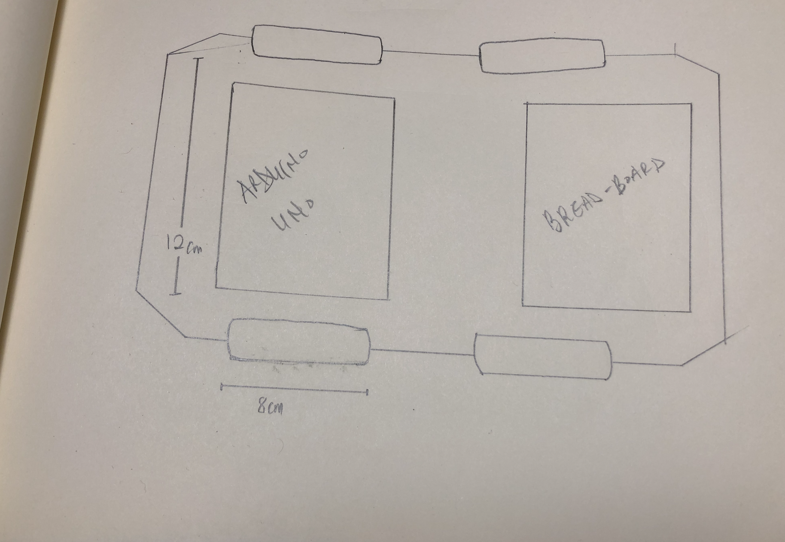
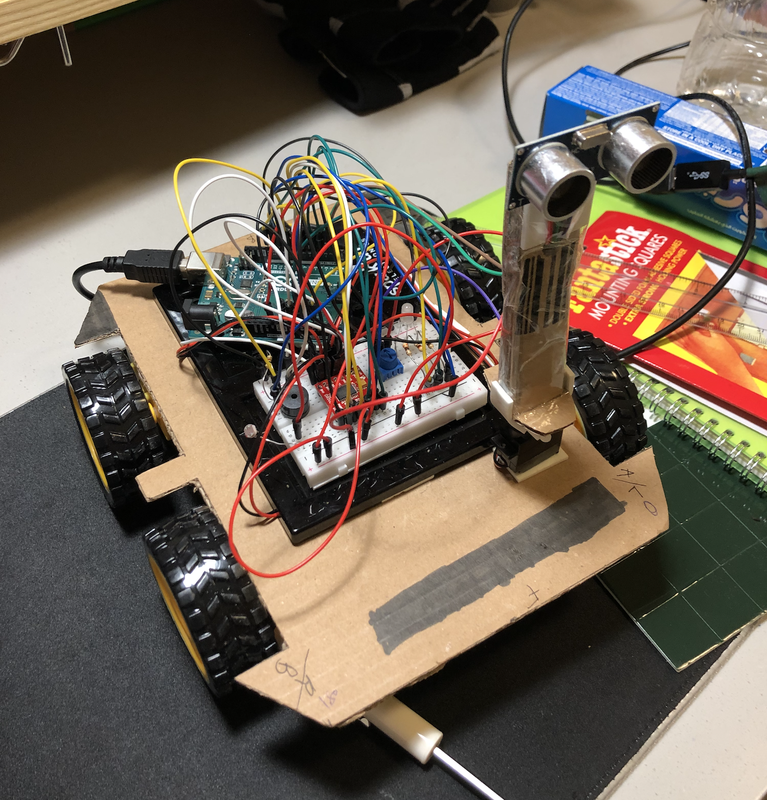
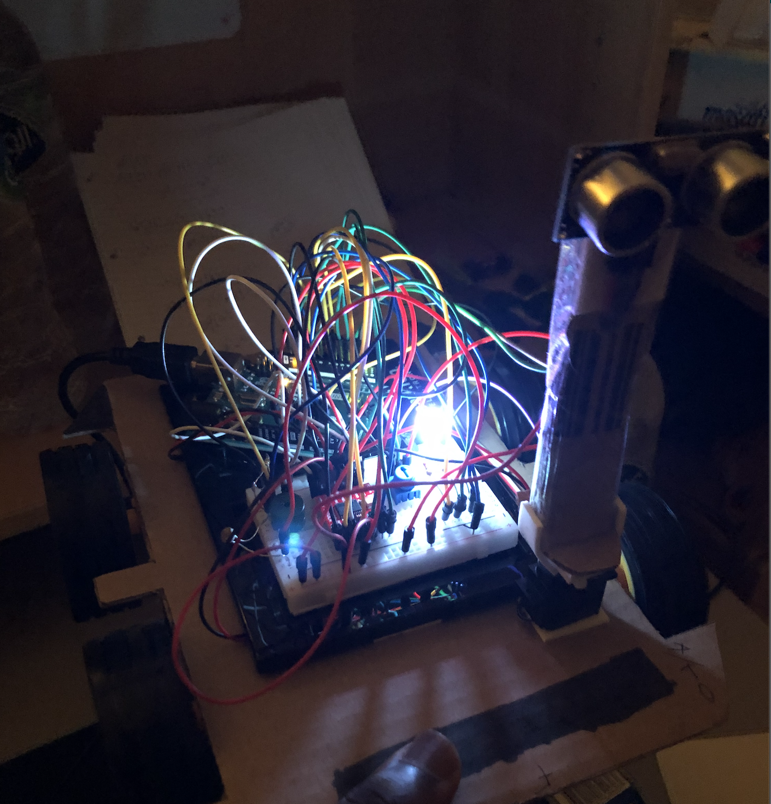
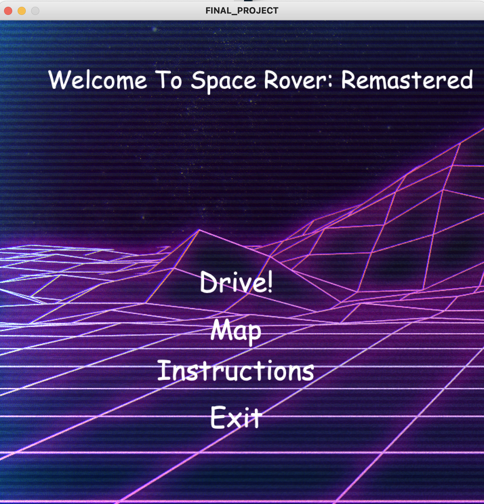
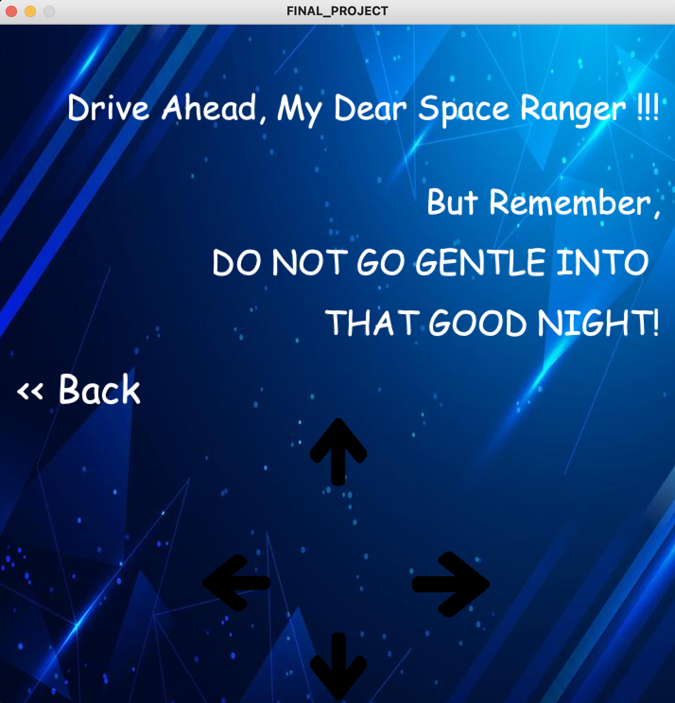
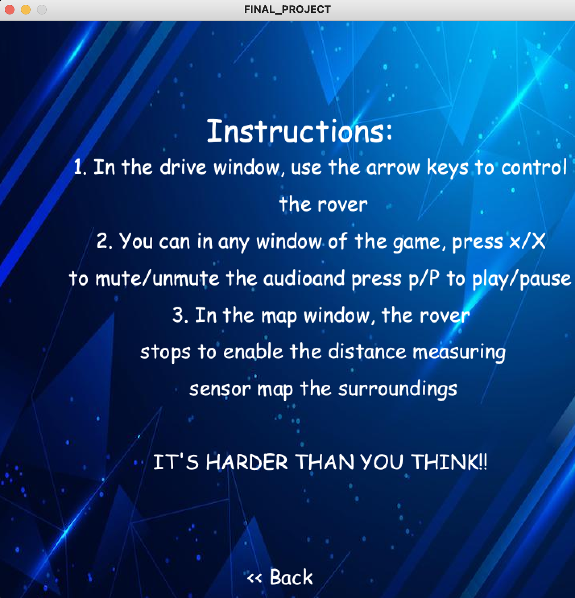
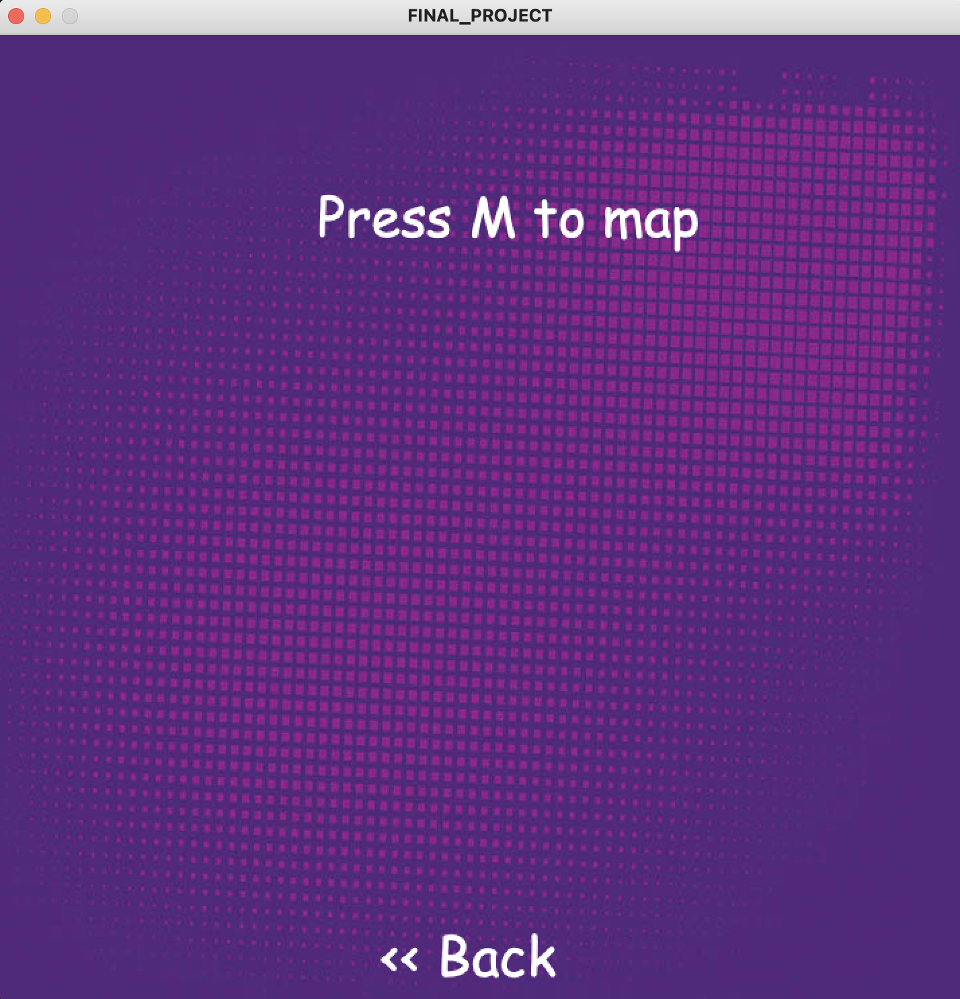

## Journal For Final Project
I am basing this project off of the inspiration I drew from the Mars rovers Curiosity and Perseverance. So, this project would be a rover with four tires equipped with the ability to map the surrounding, move in all four cardinal directions, mount a phone for recording video, and obstacle avoiding capabilities. The rover would be controlled by a processing interface.

### Picture References

## Project Drawings 

## Project Details - 06/30/2021
- The rover would have two modes depending the position of the potentiometer. The first mode is the **Manual Mode**. If the potentiometer is all the way down, then that would be manual mode, where the user would have to control the rover with processing. The second mode is **Self-Driving Mode**. If the potentiometer is all the way up, that would be self-driving mode where the rover would drive itself and avoid obstacles. The user would also be able to put the rover into self-driving mode from processing.
- The Distance Measuring Sensor (DMS) would be mounted on the servo, and would serve two main functions: the first is to avoid obstacles and the second to map the surroundings.
- The Processing interface would have a main game class which would control the key presses and send the information to the serial port. When the game is loaded, the user would be greeted with a screen where they can choose which operation they want such as Start, Map, Instructions, and Exit. The Map screen can also be accessed from the start screen. 

## Project Images - 07/01/2021
Today, I worked on the body of the rover and attached the tires. I also detailed the logic for the game and all the relevant parts to incorporate both from arduino and processing. 

## Journal - 07/02/2021
Today, I completed the rest of the body of the rover and the circuit. I connected all the relevant components and stuck everything to the chassis. I also mounted the distance measuring sensor to the servo. I also worked on the code to make the rover light-up when the environment is dark. I used the values from the LDR to make the RGB Led light up. 

## Journal - 07/03/2021
Today, I worked on the self-driving mode which is initiated when the potentiometer is less than 30% of the way. The main challenges I faced with this was that the DMS was not entirely accurate which sometimes resulted in a feedback loop where the rover just moved in circles. Though not an entire solve, moving the sensor to the center of the chassis of the rover reduced the occurance of this problem. 
[Here](https://youtu.be/HsgtFkQRFH0) is a link to the self-Driving mode of the rover.

## Journal - 07/04/2021
The next stage was working on the Processing component of the project, so today, I worked on that. I made the welcome page of the game with options to drive, map, instructions, and exit using the concept of state machines. I also added background music from one of my favourite composers Hans Zimmer.

## Journal - 07/05/2021
Today, I completed all the other screens of the project including the instructions screen, map screen and drive screens. Since there were a number of buttons, the biggest challenge if faced was figuring out how to position the different buttons relative to everything else.

## Journal - 07/06/2021 and 07/07/2021
The project was almost complete at this point after I worked on the communication from arduino to processing. But I ran into a problem when I tried to control the rover in processing, so I had to create different functions to control the rover in my arduino code. I also ran into another problem when I tried to toggle modes using both arduino and processing so I defaulted to using just arduino.

## Video Links
Here are links to videos of the different stages and modes of the rover. 

[Here is a link to the rover mapping](https://youtu.be/VwGWEEjFZOw)        
[Here is a link to the rover in self driving mode](https://youtu.be/HsgtFkQRFH0)      
[Here is a link to the rover in manual control mode](https://youtu.be/VwGWEEjFZOw)         

Thank you!
