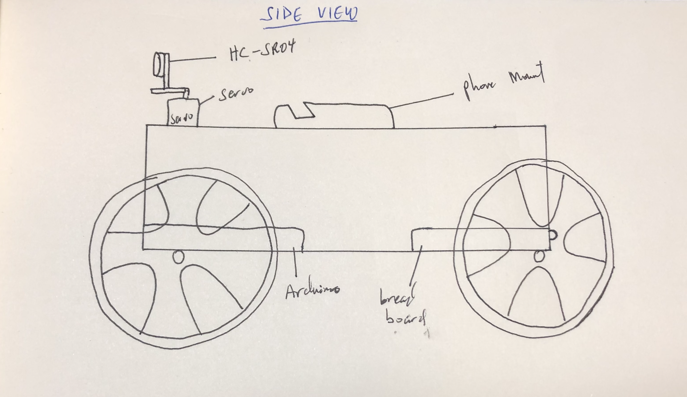

## Journal For Final Project
I am basing this project off of the inspiration I drew from the Mars rovers Curiosity and Perseverance. So, this project would be a rover with four tires equipped with the ability to map the surrounding, move in all four cardinal directions, mount a phone for recording video, and obstacle avoiding capabilities. The rover would be controlled by a processing interface.

### Picture References

## Project Drawings 

## Project Details - 06/30/2021
- The rover would have two modes depending the position of the potentiometer. The first mode is the **Manual Mode**. If the potentiometer is all the way down, then that would be manual mode, where the user would have to control the rover with processing. The second mode is **Self-Driving Mode**. If the potentiometer is all the way up, that would be self-driving mode where the rover would drive itself and avoid obstacles. The user would also be able to put the rover into self-driving mode from processing.
- The Distance Measuring Sensor (DMS) would be mounted on the servo, and would serve two main functions: the first is to avoid obstacles and the second to map the surroundings.
- The Processing interface would have a main game class which would control the key presses and send the information to the serial port. When the game is loaded, the user would be greeted with a screen where they can choose which operation they want such as Start, Map, Instructions, and Exit. The Map screen can also be accessed from the start screen. 

## Project Images - 07/01/2021
Today, I worked on the body of the rover and attached the tires. I also detailed the logic for the game and all the relevant parts to incorporate both from arduino and processing. 

<img
