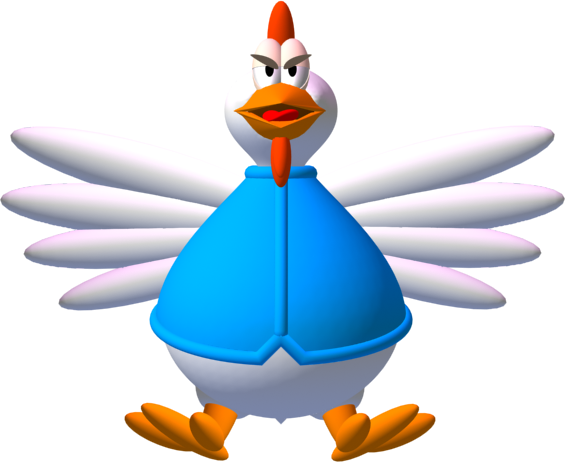

# CHICKEN INVADERS REMASTERED
This is a single-player space odyssey game. The game is set in an apocalyptic era where chickens have taken over 
the galaxy. Armed with a a spaceship and powerups, it is the protagonist's job to destroy all the chickens and proceed to more advanced levels. There are also power-ups the player can collect to change bullet types.

## Background

The background was made to include the parallax effect of zooming through space.

### Instructions
- Move the spaceship by moving the mouse 
- Press m to mute/unmute audio
- Press p to play/pause the game

### Win/Lose
- The game runs an infinitely number of levels so the goal is to beat your previouse highScores.
- If an egg touches you, you lose.

### Sprites

