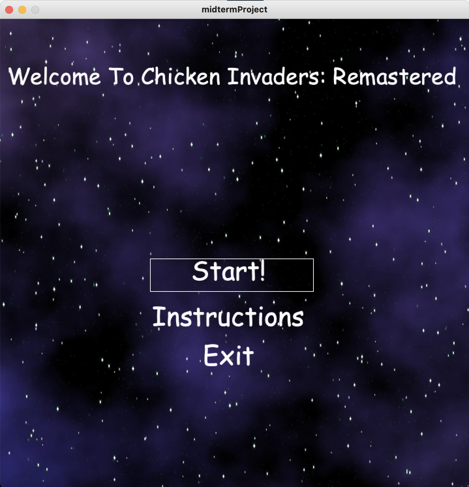
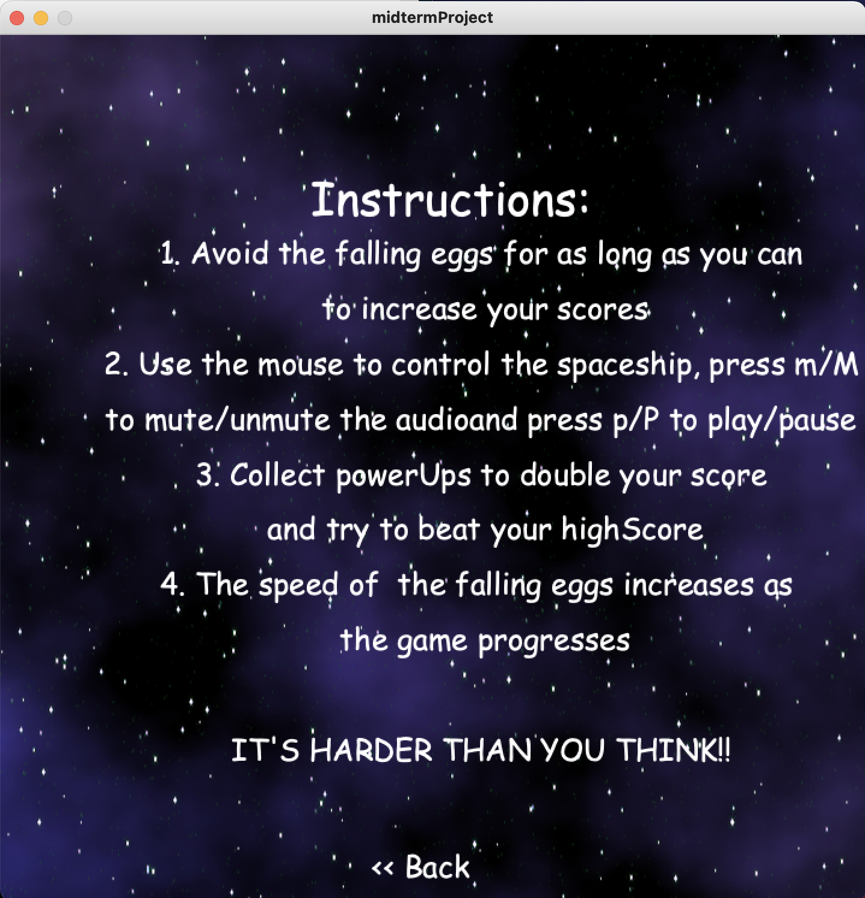
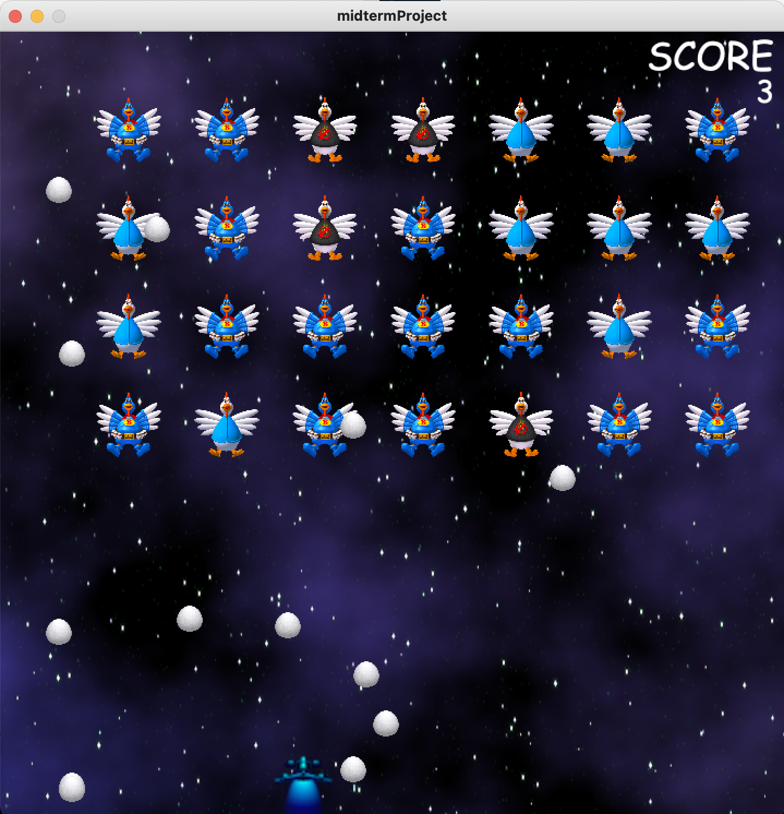
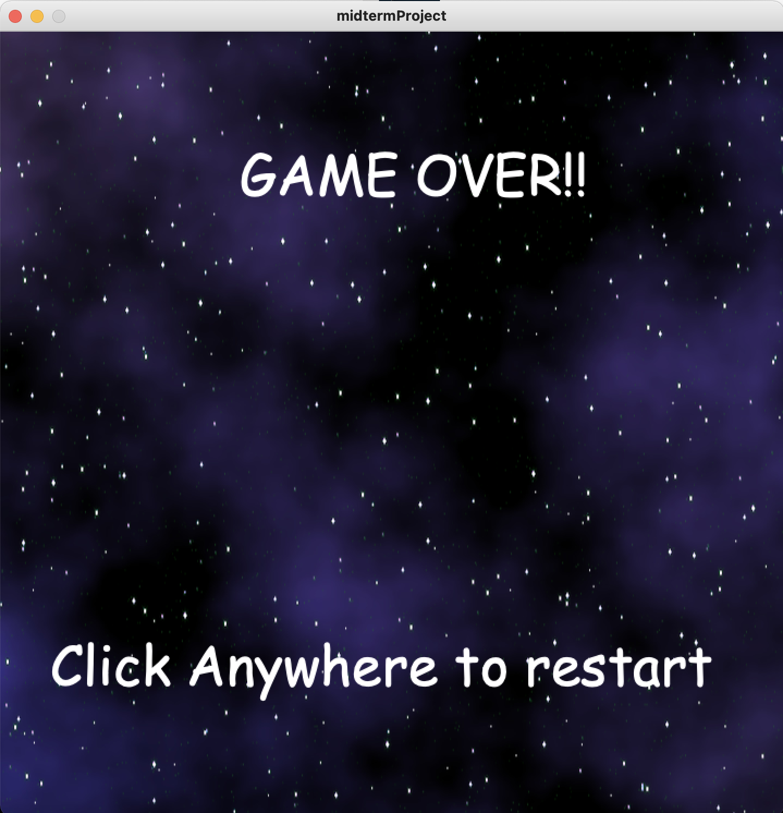

# CHICKEN INVADERS REMASTERED
This is a single-player space odyssey game. The game is set in an apocalyptic era where chickens have taken over 
the galaxy. Armed with a a spaceship and powerups, it is the protagonist's job to destroy all the chickens and proceed to more advanced levels. There are also power-ups the player can collect to change bullet types.

## Background

The background was made to include the parallax effect of zooming through space.

### Instructions
- Move the spaceship by moving the mouse 
- Press m to mute/unmute audio
- Press p to play/pause the game

### Win/Lose
- The game runs an infinitely number of levels so the goal is to beat your previouse highScores.
- If an egg touches you, you lose.

### Sprites
#### The Egg Sprite

#### The Spaceship Sprite

#### The Powerup Sprite

#### The Chicken Sprite

### Game Stages
#### 1. The Home Screen stage

This is the screen the player is greeted with. The player can choose to play the game, read the instructions or quit the game.

#### 2. The Instructions stage

This screen has instructions on how to play the game and all the important controls the player needs to know

#### 3. The Main Game Screen

This is the main game screen where the user can play the game and try to beat their highscore.

#### 4.  Game Over Screen

This is the game over screen where the player can click anywhere to restart the game.

### Conclusion
The biggest challenge was figuring out how to change my first idea of a shooting game with levels to an infinite run obstacle avoiding game. This project also taught me a lot about processing and Java programming.

