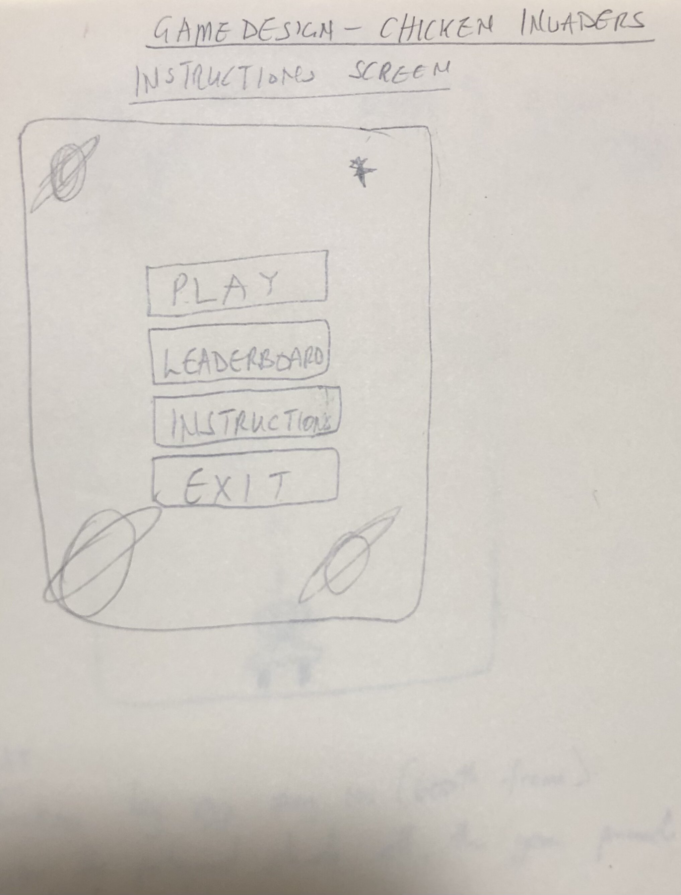
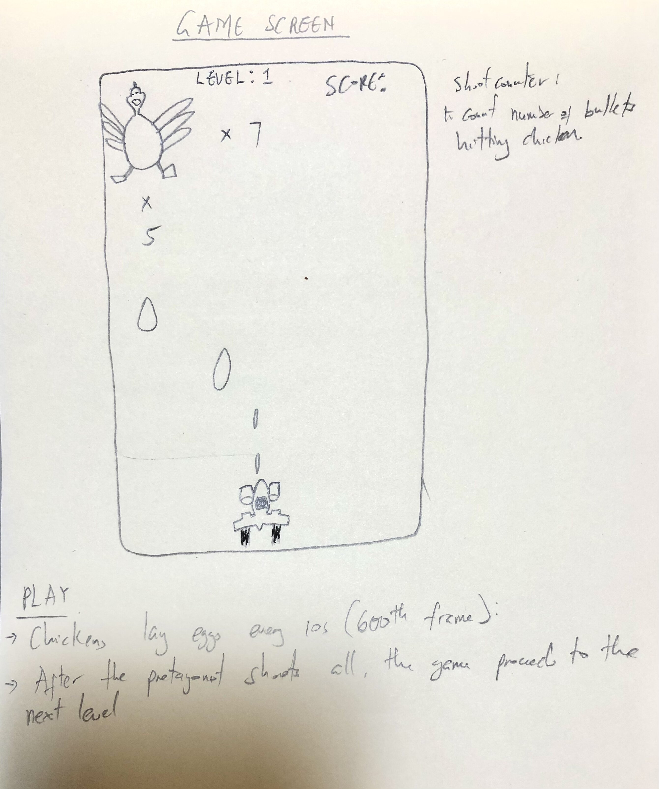
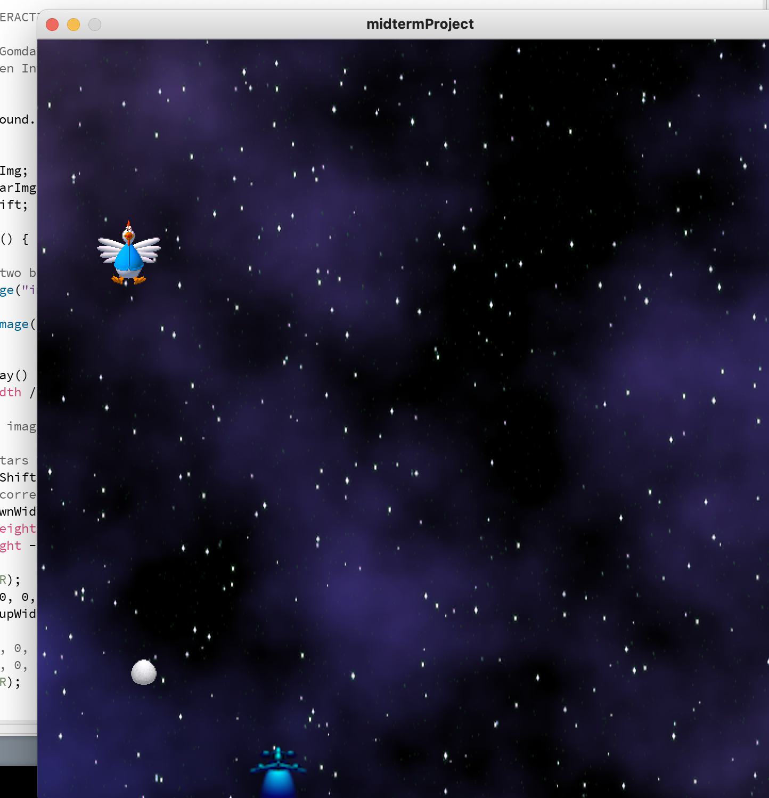

# Journal For my Midterm Project
## Preliminary Description - 06/08/2021
I plan to make an adapter version of the chicken invaders game. The game would feature the protagonist a space-ship flying through space in a time where space is overtaken by chickens. Armed with an infinite number of bullets, it is the protagonist's job to shoot all the chickens and bring order to the universe.

### Sketches of rough ideas - 08/08/2021


I decided to include a leaderboard to the overall design of the game and also make the chickens lay eggs to make the game more fun. I also want to include the parallax effect into the game. I have all the images I need for the sprites, background and eggs. 

### Game Interface - 09/08/2021


Today, I finalized the sprite images and created the classes for most of the elements of the game. The basic logic of lose when the player is hit by an egg works. I also added the parallax effect to the background to make the game more lively. I am thinking of increasing the speed of both the chickens and the eggs as the player proceeds to more advanced levels. I think powerups, which change the bullets would make the game more interractive, I will use ``` frameRate``` and ``` frameCount()``` to control how long the powerups last.
