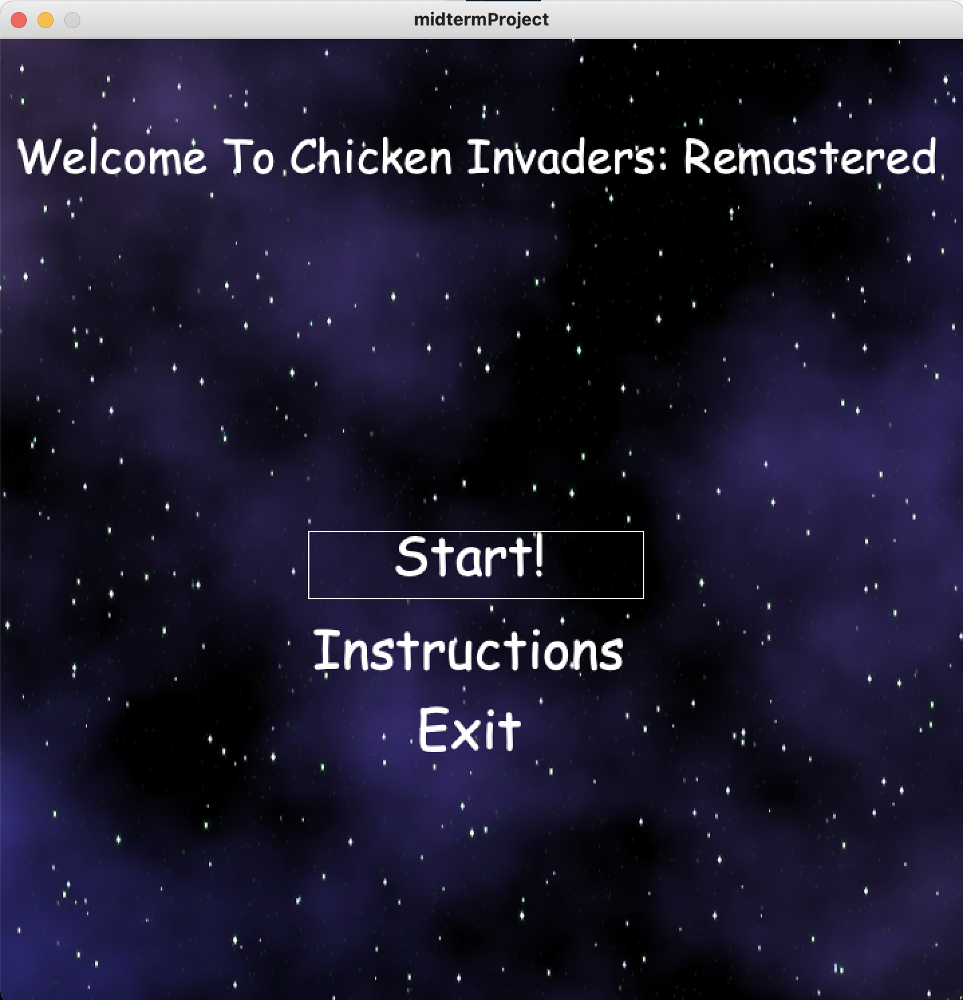

# Journal For my Midterm Project
## Preliminary Description - 06/06/2021
I plan to make an adapter version of the chicken invaders game. The game would feature the protagonist a space-ship flying through space in a time where space is overtaken by chickens. Armed with an infinite number of ~~bullets~~, it is the protagonist's job to avoid all the eggs and bring order to the universe.

### Sketches of rough ideas - 06/08/2021


I decided to include a leaderboard to the overall design of the game and also make the chickens lay eggs to make the game more fun. I also want to include the parallax effect into the game. I have all the images I need for the sprites, background and eggs. 

### Game Interface - 06/09/2021


Today, I finalized the sprite images and created the classes for most of the elements of the game. The basic logic of lose when the player is hit by an egg works. I also added the parallax effect to the background to make the game more lively. I am thinking of increasing the speed of both the chickens and the eggs as the player proceeds to more advanced levels. I think powerups, which change the bullets would make the game more interractive, I will use ``` frameRate``` and ``` frameCount()``` to control how long the powerups last. This is the code I used to create the parallax effect :
```
public void display() {
    image(bgImg, width / 2, height / 2);

    // shifting all images to the left
    yShift += 2;
    // making the stars move at half the shift speed
    int y = (int) yShift / 2;
    // calculating correct positions for the different images
    int upWidth, downWidth;
    upWidth = y % height;
    downWidth = height - upWidth;

    imageMode(CORNER);
    image(starImg, 0, 0, upWidth, height, downWidth, 0, width, height);
    image(starImg, upWidth, 0, downWidth, height, 0, 0, downWidth, height);
    imageMode(CENTER);
  }
```

### Home Screen - 06/10/2021


I dedicated today to making the home screen of the game. Positioning the text was the hardest part, but setting ```textAlign(CENTER); ``` made the text relative to the center of the rectangle around the text. Also, printing the values of  ```mouseX``` and ```mouseY``` made is easy to figure out where the hover rectangle should show. 

### Main Game Screen - 06/11/2021


I scrapped the shooting idea and made it an infinite running game where the protagonist avoids falling eggs. I then had to make the game more interactive so I decided to add more powerups, different chickens and different spaceships. However, today I worked on the entire logic of the game such as creating and releasing the eggs, checking the distances between eggs and the player. 

### Game Over, PowerUps and HighScore - 06/12/2021


Today, I worked on the game over screen, the powerups of the game and the highScore. I created a file to write new highScores to and keep track of previous highScores. I also included two powerups into the game, the first to double the score and the second to change the spaceship.

### Instructions and Final touches - 06/13/2021


I finalized the project with the instructions page and some other features such as muting/unmuting the audio and play or pause the game. The ```.volume()``` method was really useful in setting the volume of the entire game.

### Conclusion
This project thought me a lot about the different aspects of processing such as sound, images, and shapes and how they all integrate together. I gained a lot of hands-on experience in Java programming.

                                           
